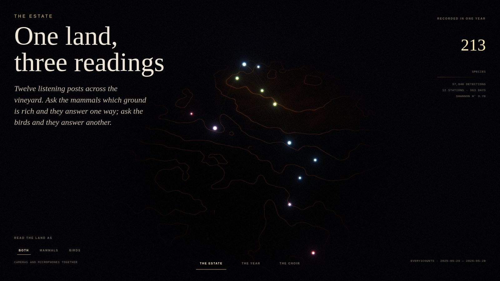
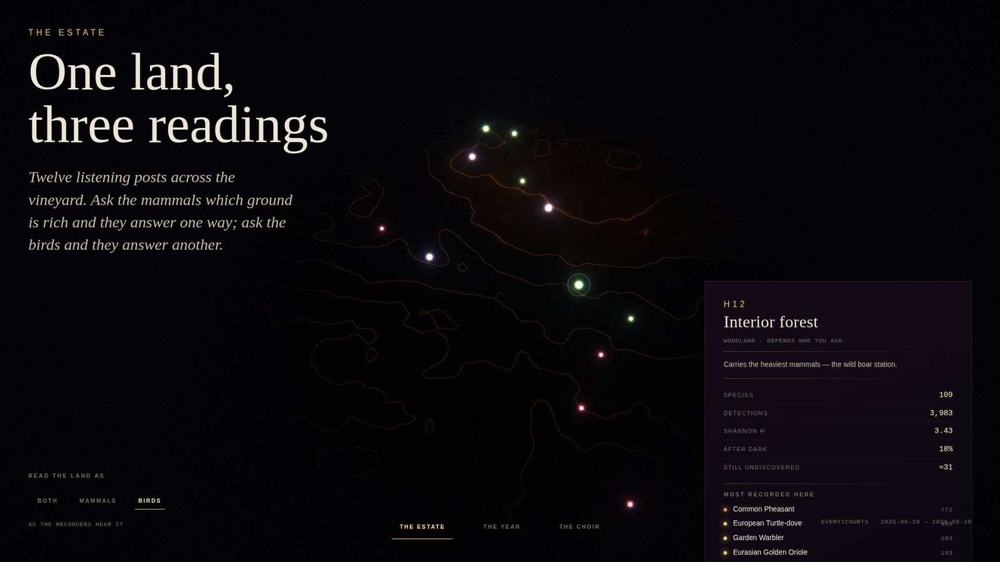
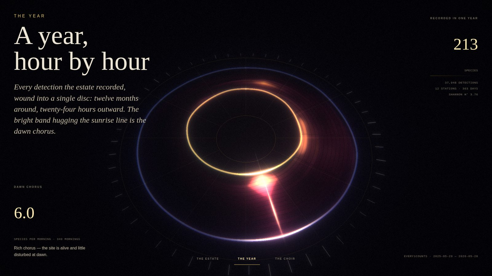
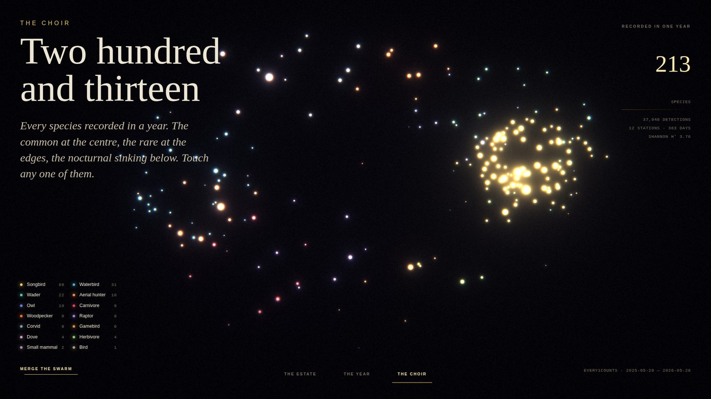
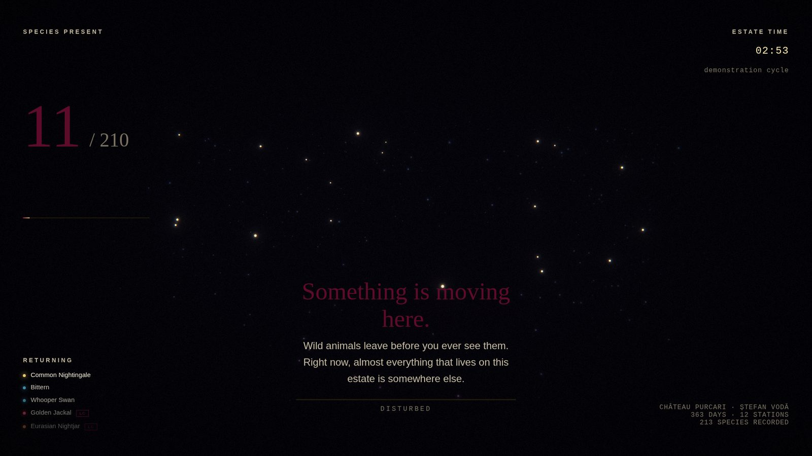

# Terroir Vivant / Presence — installation guide

Two media-art pieces built on one year of biodiversity monitoring at Château
Purcari (Ștefan Vodă, Moldova).

| | Indoor | Outdoor |
|---|---|---|
| Title | **Terroir vivant** | **Presence** |
| Entry | `/indoor.html` | `/outdoor.html` |
| Surface | Touchscreen panel inside the château | Projection or LED wall, sheltered |
| Input | Direct touch | Camera + microphone (+ optional serial sensors) |
| Duration | Visitor-paced; 34–40 s attract loop per chapter | ~60 s to complete the arc |
| Runs unattended | Yes | Yes |

Both read the same runtime bundle, `public/data/installation.json`, so a data
refresh updates both pieces at once.

---

## 0. What it looks like

Captured from the running build at 1920×1080.

**The Estate** — the twelve stations over the estate's landform, coloured by the
survey's combined typology. Green is the rich stable core, red the poor edges.



The same land, re-read by birds alone. Stations that were poor become rich and
the reverse — the disagreement is the chapter's argument.



**The Year** — twelve months around, twenty-four hours outward. The gold ribbon
is sunrise, the blue is sunset, and the warm band hugging the gold is the dawn
chorus.



**The Choir** — all 213 species, sorted into ecological guilds.



**Presence** — the outdoor piece mid-arc, the field scattered and the count low
while the space is disturbed.



---

## 1. The work

### Terroir vivant (indoor)

The estate's own terroir survey reads the land *downward* — 16,000 resistivity
measurements per hectare, into geology, arriving at the wine. This piece reads
the same land *upward*, into the animals living on top of it.

Three chapters, cycling on an attract loop until someone touches the screen:

1. **The Estate** — the twelve monitoring stations at their true relative
   positions on an evocation of the estate's terrain. The chapter's argument is
   the survey's own: *the same land classifies differently depending on which
   animals you ask.* The three lenses — Both / Mammals / Birds — recolour the
   stations in place. H10 is a rich station to a microphone and a nearly empty
   one to a camera; H7 is the reverse.
2. **The Year** — every detection wound into a single disc: twelve months
   around, twenty-four hours outward, with the sunrise and sunset ribbons
   tracking the seasons. The bright band hugging the sunrise line is the dawn
   chorus.
3. **The Choir** — all 213 species at once. Common species at the luminous
   centre, rare at the edges, nocturnal sinking below. Touch any mark for that
   animal's record and its own 24-hour rhythm.

### Presence (outdoor)

One sentence: **stand still, and the wild comes back.**

Every mote is one animal, drawn from the species genuinely active at the current
hour according to the survey's hourly profiles. Movement and noise scatter the
field. Stillness brings it back — in the order the data says it should, common
and bold first, rare and nocturnal last. A full minute of stillness restores the
entire chorus.

The mechanic is the argument. The survey's dawn-chorus measure is a measure of
*undisturbedness*; the only way to see this estate at its richest is to stop
disturbing it.

Wariness is not a measured field value — the survey carries no flight-initiation
distances. It is composed from three proxies the data does carry: rarity,
nocturnality, and how few stations the animal tolerates. See
`src/installation/core/data.ts`.

---

## 2. Running it

```bash
npm install
npm run data          # rebuild public/data/installation.json from raw CSV exports
npm run dev           # then open /indoor.html or /outdoor.html
npm run build         # emits all three entries to dist/
npm run preview
```

`npm run data` expects the raw Every1Counts exports. Point it at new ones with:

```bash
python3 scripts/build_installation_data.py \
  --camera path/to/export_biodiversite_sitecamera.csv \
  --sound  path/to/export_biodiversite_site_sound.csv \
  --out    public/data/installation.json
```

Requires Python 3 with `pandas`.

### URL parameters (outdoor)

| Parameter | Effect |
|---|---|
| `?simulate=1` | Ignore real sensors and drive the piece from synthesised signals. Use for bench testing and for gallery fallback. |
| `?diag=1` | Show the installer diagnostics panel. |

Keyboard, both pieces: `F` fullscreen · `D` toggle diagnostics (outdoor) ·
`←`/`→` change chapter (indoor).

---

## 3. Hardware

### Indoor touchscreen

- Any panel ≥ 32", landscape or portrait; the layout is fluid. 1080p is
  sufficient — the render is deliberately soft and grainy.
- A GPU that can hold 60 fps at the panel's native resolution. Integrated
  graphics from the last five years are fine; the heaviest scene draws ~213
  points and one full-screen bloom.
- Chrome or Edge in kiosk mode:
  ```
  chrome --kiosk --incognito --noerrdialogs --disable-pinch \
         --autoplay-policy=no-user-gesture-required \
         http://localhost:4173/indoor.html
  ```
- Audio is optional but recommended: a small speaker under the panel.

### Outdoor

- **Display**: short-throw projector onto a wall or a weatherised LED panel.
  The piece is graded for near-total darkness; in ambient light, raise
  `bloomStrength` and lower `grain` in `OutdoorApp.tsx`.
- **Camera**: any USB webcam with a wide lens, mounted facing the viewing area,
  ideally 2.5–4 m up and angled down. It is used only for frame-difference
  motion sensing at 96×72 — no image is stored, transmitted, or shown.
- **Microphone**: a USB or 3.5 mm mic in the same area. Used for level and
  spectral brightness only; no audio is recorded.
- **Optional serial sensors**: any board (Arduino, ESP32) writing
  newline-delimited JSON at 115200 baud:
  ```json
  {"t":21.4,"wind":3.2,"lux":840,"pir":1,"dist":180}
  ```
  All fields optional. Connect from the diagnostics panel. Requires a
  Chromium browser (Web Serial). If no board is attached, temperature/wind/lux
  stay `null` rather than being invented — they must never reach a wall label
  as fabricated numbers.

Browsers only grant camera, microphone and serial access from a **user
gesture** and over **HTTPS or `localhost`**. The "Begin" screen exists to
provide that gesture. For a permanent install, serve over `localhost` on the
kiosk machine, or provision a certificate, and pre-grant the permissions in the
browser profile so the piece survives a reboot without a prompt.

---

## 4. Data provenance and honesty notes

These matter for wall text — the piece states real numbers and must not
overclaim.

- **Survey**: Every1Counts, 12 months, 29 May 2025 – 28 May 2026. Twelve
  stations, each a camera trap paired with an acoustic recorder. Bird
  identification by BirdNET (Kahl et al. 2021).
- **Species counts differ by filter.** The runtime bundle uses the delivered
  exports: 35 camera species, 197 acoustic species, 213 distinct overall. The
  analysis deck quotes 195 birds at confidence > 0.8 and an effort-standardised
  camera richness of 26. Neither is wrong; they answer different questions. If
  wall text needs one number, use the deck's public line — *"almost 200 bird
  species"*.
- **Day/night** is recomputed here from civil twilight at 46.52 N / 29.87 E for
  each detection's own date. It reproduces the report's *ranking* of stations
  exactly — H14 most nocturnal, H4 and HC least — but runs lower in absolute
  terms, because the report layers a nominal 07:00–19:00 window on top of
  twilight. Figures shown on screen are ours, computed as described.
- **The sounds are synthesised, not recordings, and the wall label must say so.**
  The survey ships detection metadata only; no audio was exported with it. Each
  voice is generated from that species' own numbers — guild sets the vocal
  apparatus and register, rarity raises the pitch within that register, peak
  hour sets the phrasing, night ratio sets how much room the voice sits in, and
  the scientific name seeds a hash so an animal always sounds like itself.

  This is a choice, not a shortfall. An AI-generated imitation of a real tawny
  owl, played beside *"Strix aluco, 716 detections"*, would be read as a field
  recording — a fabrication in a scientific frame. A voice audibly built out of
  the data is honest, and says the same thing the rest of the piece says.

  Suggested wording: *"No recordings were made. Each voice is synthesised from
  that species' own measurements."*

  `SoundField.play` in `core/audio.ts` is the single seam to swap for buffer
  playback if real BirdNET segments arrive; scheduling, polyphony,
  spatialisation and the chorus all stay as they are.

  **Note:** `data.geojson` in this repository references **17,222 `.wav` files**
  (`SM218/….wav`, labelled by species) and camera-trap stills from `ct45`,
  `ct47`, `ct48`. The files themselves are not in the repository. If that media
  export can be obtained, it replaces the synthesis with real audio of real
  animals from this estate — by far the largest available upgrade to the piece.
- **The terrain is an evocation, not a DEM.** No elevation model ships with the
  survey. The ground in "The Estate" is layered noise biased along the Dniester
  valley axis, washed with the estate's three landscape units (Podiș, Coline,
  Poale). Station *positions* are real; the ground beneath them is not survey
  data.
- **The tension worth stating on the wall**: the survey finds Purcari the most
  species-rich site in the Every1Counts network — a genuine refuge — while the
  CSRD assessment records ProtConn 0.0%, 0 hectares protected, 0 Natura 2000
  zones. It is a refuge with no legal standing.

---

## 5. Structure

```
scripts/build_installation_data.py   raw CSV exports -> runtime bundle
public/data/installation.json        the bundle both pieces read

src/installation/
  core/
    types.ts        runtime shapes, and the SensorState contract
    data.ts         loader, layout projection, wariness, selectors
    palette.ts      the visual system + Purcari house tokens
    audio.ts        data-driven sonification
  gl/
    chunks.ts       shared GLSL (noise, dither, tonemap, sprite)
    Stage.tsx       canvas, bloom, grade, camera rig — shared by both pieces
    Constellation.tsx  indoor ch.1 — the estate and its three readings
    Chronogram.tsx     indoor ch.2 — the year as a disc
    Choir.tsx          indoor ch.3 — all 213 species
    PresenceField.tsx  outdoor — the stillness mechanic
  sensors/
    useMotionSensor.ts   webcam frame differencing
    useAmbientSound.ts   microphone level + spectrum
    useSerialSensors.ts  optional hardware over Web Serial
    useSensorBus.ts      unified SensorState + simulation fallback
  indoor/   IndoorApp.tsx, main.tsx
  outdoor/  OutdoorApp.tsx, main.tsx
  ui/       installation.css
```

Scenes read sensor state from a **ref**, updated every frame, never from React
state — a 60 fps `setState` would stall the render. The bus publishes a separate
coarse readout four times a second for text.

---

## 6. Tuning on site

Most adjustments are constants at the top of a single file.

| Want | Change |
|---|---|
| Faster/slower return of the fauna | `stillnessSeconds / 60` in `PresenceField.tsx`, and the `STAGES` thresholds in `OutdoorApp.tsx` |
| Piece too twitchy in a busy space | Raise the stillness reset threshold in `useSensorBus.ts` (`0.3`) |
| Animals flee too readily | Lower the flight `trigger` multiplier in `PresenceField.tsx` |
| Brighter for an ambient-lit room | `bloomStrength` / `vignette` props on `<Stage>` |
| Longer attract dwell | `dwell` per chapter in `IndoorApp.tsx` |
| Idle before attract resumes | `IDLE_RESUME_MS` in `IndoorApp.tsx` |
| Mute | `soundField.setVolume(0)`, or simply do not connect a speaker |
| Chorus too busy / too sparse | polyphony cap in `core/audio.ts` (`maxPolyphony`), and the density argument passed to `Chorus.update` in each app |
| A species sounds wrong | its register and timbre come from its guild — see `GUILD_REGISTER` and `GUILD_TIMBRE` in `core/audio.ts` |

### Auditioning the voices

`/audio-check.html` on the **dev server only** (`npm run dev`) renders every
guild's voice offline and reports peak, RMS, length and spectral centroid, so
the synthesis can be checked without listening to 213 phrases. Click any row to
hear it. It is not one of the Vite build entries, so it never ships to a kiosk.

What good looks like, and what the current build measures:

- no silent voices, no clipped voices
- spectral centroid spread **4,825 Hz** — doves and owls near 500–900 Hz,
  warblers and finches above 4,700 Hz, which is the right ecological ordering
- per-voice peaks within about 2.6× of each other, so no guild disappears under
  a chorus

Re-run it after any change to the synthesis. It has already caught two real
faults: every voice rendering silent (the rate-limiter rejected the first voice
on a fresh context, where `currentTime` is 0), and noise-based voices — rook,
pheasant, woodpecker, wood mouse — coming out five times quieter than the tonal
ones because a narrow bandpass discards most of the noise energy.
